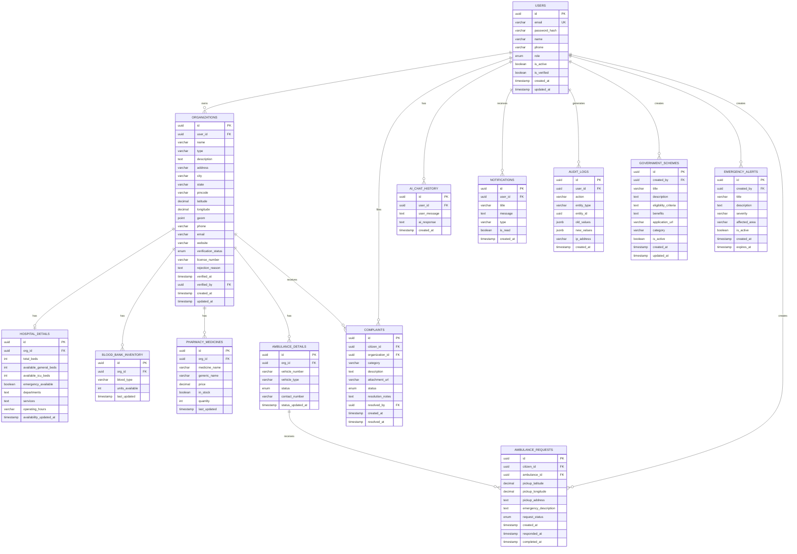
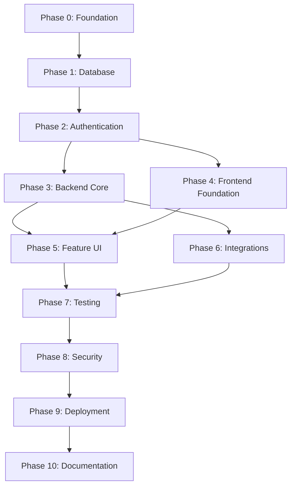

# Civic Health & Emergency Assistance Platform — Senior Architect Analysis

> **Status:** PLANNING — No implementation has been started.
> **Author:** Senior Software Architect / Technical Lead
> **Date:** 2026-08-28
> **Project Codename:** CivicConnect

---

# Table of Contents

- [Phase 1 — Project Understanding](#phase-1--project-understanding)
- [Phase 2 — Technical Feasibility](#phase-2--technical-feasibility)
- [Phase 3 — Technology Stack Options](#phase-3--technology-stack-options)
- [Phase 4 — Technology Comparison](#phase-4--technology-comparison)
- [Phase 5 — Architecture Options](#phase-5--architecture-options)
- [Phase 6 — Recommended Architecture](#phase-6--recommended-architecture)
- [Phase 7 — PRD](#phase-7--prd)
- [Phase 8 — System Design](#phase-8--system-design)
- [Phase 9 — Implementation Plan](#phase-9--implementation-plan)
- [Phase 10 — Development Order](#phase-10--development-order)
- [Phase 11 — Testing Strategy](#phase-11--testing-strategy)
- [Phase 12 — Walkthrough Plan](#phase-12--walkthrough-plan)
- [Phase 13 — Documentation Plan](#phase-13--documentation-plan)
- [Phase 14 — AI Development Strategy](#phase-14--ai-development-strategy)
- [Phase 15 — Risk Register](#phase-15--risk-register)
- [Phase 16 — Final Recommendation](#phase-16--final-recommendation)

---

# Phase 1 — Project Understanding

## Core Problem Being Solved

Citizens in India (and similar contexts) lack a **single, unified platform** to find verified, real-time information about healthcare services during emergencies and routine needs. Information about hospital beds, blood availability, ambulance status, nearby pharmacies, and government health schemes is scattered across disconnected websites, phone numbers, and word-of-mouth — leading to **preventable delays, confusion, and poor health outcomes**.

## Target Users

| User Type | Description |
|-----------|-------------|
| **Citizens** | General public seeking healthcare info, emergency help, blood, medicines |
| **Hospitals** | Manage bed availability, emergency status, publish services |
| **Pharmacies** | Publish medicine availability, location, operating hours |
| **Blood Banks** | Manage blood inventory by type, accept donation requests |
| **Ambulance Providers** | Manage fleet, respond to requests, publish availability |
| **NGOs** | Coordinate health campaigns, volunteer efforts, disaster response |
| **Government/Authority** | Publish health schemes, monitor compliance, review complaints |
| **System Admin** | Manage platform, verify organizations, moderate content |

## Main Use Cases

1. **Emergency Hospital Search** — Citizen finds nearest hospital with available ICU/general beds
2. **Blood Availability Check** — Citizen/hospital searches blood banks by blood type and location
3. **Ambulance Request** — Citizen requests nearest available ambulance
4. **Medicine/Pharmacy Finder** — Citizen searches for medicine availability nearby
5. **Government Scheme Lookup** — Citizen checks eligibility for health schemes
6. **Public Complaint Filing** — Citizen files complaints about healthcare services
7. **Organization Dashboard** — Hospitals/pharmacies/blood banks manage their listings and availability
8. **AI Health Assistant** — Citizen asks health-related questions (informational only, not diagnostic)
9. **Emergency Alerts** — Authorities broadcast health alerts (disease outbreaks, disasters)
10. **Analytics Dashboard** — Admin/authority views aggregate health service data

---

## Requirements Prioritization (MoSCoW)

### Must Have (MVP)

| ID | Requirement |
|----|-------------|
| MH-01 | User registration and authentication (citizen + organization roles) |
| MH-02 | Organization verification workflow (admin approves hospitals, pharmacies, etc.) |
| MH-03 | Hospital listing with bed availability (ICU/general) — manually updated by hospital staff |
| MH-04 | Blood bank listing with blood type availability |
| MH-05 | Pharmacy/medicine search by name and location |
| MH-06 | Ambulance provider listing with availability status |
| MH-07 | Map-based search for all facility types (location-aware) |
| MH-08 | Role-based access control (RBAC) for all 8 roles |
| MH-09 | Organization dashboard for managing listings |
| MH-10 | Government health scheme directory with basic eligibility info |
| MH-11 | Public complaint/report submission |
| MH-12 | Admin panel for user/org management, verification, moderation |
| MH-13 | REST API with proper auth, validation, error handling |
| MH-14 | Responsive web UI (mobile-first) |
| MH-15 | Search and filtering across all entity types |
| MH-16 | Basic audit logging |

### Should Have

| ID | Requirement |
|----|-------------|
| SH-01 | AI-powered health information assistant (chatbot) |
| SH-02 | Notification system (in-app + email for critical updates) |
| SH-03 | Emergency alert broadcasting by authorities |
| SH-04 | Analytics dashboard for admin/authority |
| SH-05 | CSV/bulk data upload for organizations |
| SH-06 | Blood donation request/scheduling |
| SH-07 | Ambulance request workflow (citizen → provider → status tracking) |
| SH-08 | Complaint tracking and resolution workflow |

### Could Have

| ID | Requirement |
|----|-------------|
| CH-01 | SMS notifications |
| CH-02 | Push notifications (PWA) |
| CH-03 | NGO campaign management |
| CH-04 | Multi-language support (Hindi + English) |
| CH-05 | Document/file uploads (medical reports, scheme documents) |
| CH-06 | Advanced analytics with charts and trend data |
| CH-07 | Public health data visualization (heatmaps) |
| CH-08 | Feedback/rating system for facilities |

### Out of Scope

| ID | Why |
|----|-----|
| OS-01 | **Telemedicine / Video consultation** — Requires HIPAA-grade infra, WebRTC, legally complex |
| OS-02 | **Electronic Health Records (EHR)** — ABDM integration requires formal NHA onboarding, HL7 FHIR compliance, months of certification |
| OS-03 | **Payment processing** — Adds PCI-DSS compliance burden, unnecessary for MVP |
| OS-04 | **Native mobile apps** — Responsive PWA is sufficient; native adds 2x development |
| OS-05 | **Real-time GPS ambulance tracking** — Requires dedicated mobile driver app, constant GPS streaming, complex infra |
| OS-06 | **ABDM/ABHA integration** — Formal government onboarding process incompatible with academic timeline |
| OS-07 | **Insurance/claims processing** — Separate domain entirely |
| OS-08 | **Prescription management** — Regulatory complexity |

---

## Non-Functional Requirements

| Category | Requirement |
|----------|-------------|
| **Scale** | Single city/region demo; architecture should support multi-region conceptually |
| **Users** | Demo: ~100 concurrent; Architecture: supports 10K+ |
| **Data Volume** | ~1000 facilities, ~10K users, ~50K transactions for demo |
| **Performance** | API response < 500ms (p95); Map search < 1s; Page load < 3s |
| **Security** | OWASP Top 10 mitigations; encrypted passwords; JWT with proper expiry; RBAC enforcement |
| **Availability** | 99% uptime (academic demo); graceful error handling |
| **Auth** | JWT-based; role-based access; secure password storage (bcrypt) |
| **Integrations** | OpenStreetMap/Leaflet for maps; OpenAI/Gemini for AI chat; email service for notifications |
| **Real-time** | Near-real-time: availability updates via polling or SSE (not WebSocket for MVP) |

---

## Critical Assumptions (Flagged)

> [!WARNING]
> **Assumption A1:** All facility data (hospitals, pharmacies, blood banks) will be **manually entered or bulk-uploaded** by verified organizations — NOT scraped from government databases. Real government APIs (ABDM, HFR) require formal onboarding that takes months.

> [!WARNING]
> **Assumption A2:** "Real-time" bed/blood availability means **organization staff manually update their dashboard**, not automatic integration with hospital management systems. True real-time integration is out of scope for a final-year project.

> [!WARNING]
> **Assumption A3:** Ambulance "availability" means the provider marks themselves as available/busy, not GPS-tracked real-time location. Real-time GPS tracking requires a dedicated driver mobile app.

> [!IMPORTANT]
> **Assumption A4:** For the academic demo, seed data (hospitals, pharmacies, blood banks) will be a mix of **real public data** (from OpenStreetMap, data.gov.in) and **controlled simulated data** with clear labeling.

---

# Phase 2 — Technical Feasibility

## What is Easy

| Feature | Why |
|---------|-----|
| User registration/login with JWT | Standard CRUD + well-documented auth patterns in every framework |
| RBAC (role-based access) | Database flag + middleware guards; well-established pattern |
| Facility CRUD (hospitals, pharmacies, blood banks) | Standard relational data management |
| Search and filtering | SQL queries with proper indexing; full-text search if needed |
| Admin panel | CRUD operations on users and organizations |
| REST API design | Standard request/response patterns |
| Responsive UI | CSS frameworks + React component libraries handle this |

## What is Moderately Difficult

| Feature | Why | Mitigation |
|---------|-----|------------|
| **Map-based search** | Requires geospatial queries (lat/lng + radius), map component integration, geocoding | Use PostGIS for geospatial queries + Leaflet/React-Leaflet for frontend maps |
| **Organization verification workflow** | Multi-step approval process with state management, email notifications | Design clear state machine (pending → approved → rejected → suspended) |
| **AI health assistant** | Requires API integration, prompt engineering, content safety, cost management | Use OpenAI/Gemini API with pre-built prompts; rate-limit usage; add disclaimers |
| **Analytics dashboard** | Aggregation queries, chart rendering, meaningful metrics | Use SQL aggregations + a charting library (Recharts/Chart.js) |
| **Notification system** | Multiple channels (in-app, email), event triggers, delivery tracking | Start with in-app only; add email via Resend/SendGrid |
| **CSV bulk upload** | File parsing, validation, error reporting, partial success handling | Use a parsing library; validate row-by-row; return error report |
| **Multi-role dashboards** | Each role sees different UI and data; significant frontend routing complexity | Component-based architecture with role-aware route guards |

## What is Genuinely Difficult

| Feature | Why | Recommendation |
|---------|-----|----------------|
| **Real-time availability updates** | True real-time requires WebSockets/SSE infrastructure, connection management, state sync | **Simplify:** Use polling (30-60s interval) for MVP. Mention SSE as future improvement in documentation |
| **Ambulance request workflow** | State machine with multiple actors (citizen → provider → accept/reject → en route → arrived), timeout handling, concurrent request conflicts | **Simplify:** Implement as a basic request queue with status updates. Skip real-time tracking |
| **Complaint resolution workflow** | Multi-step process across roles (citizen → admin → authority → resolution), status tracking, SLA | **Simplify:** Basic ticket system (open → in-progress → resolved → closed) |
| **Data verification & trust** | How do you verify that a hospital's bed count is accurate? How do you prevent stale data? | **Accept the limitation:** Add "last updated" timestamps; flag stale data (>24h); admin can audit |

## Potential Bottlenecks

1. **Geospatial queries at scale** — Solved by PostGIS spatial indexes; not a real concern at demo scale
2. **AI API costs** — Rate-limit per user; cache common queries; set daily budget caps
3. **Concurrent availability updates** — Optimistic locking on availability records prevents conflicts
4. **Map tile loading** — Use OpenStreetMap tiles (free) or Mapbox (free tier generous)

## Unrealistic for Final-Year Project

| Feature | Why Unrealistic |
|---------|-----------------|
| True real-time GPS tracking | Requires native mobile driver app, constant GPS streaming, significant infra |
| ABDM/HFR integration | Formal government onboarding process takes months |
| SMS notifications at scale | Requires paid SMS gateway, regulatory compliance |
| Production-grade SLA monitoring | Over-engineering for academic scope |
| Multi-region deployment | Single region is sufficient for demonstration |

## Features to Mock/Simulate for Demo

1. **Bed availability updates** — Pre-seed with realistic data; simulate periodic changes via a script
2. **Blood bank inventory** — Seed with realistic distribution; demo updates via organization dashboard
3. **Ambulance dispatch** — Show the workflow with test data; simulate "arrival" status changes
4. **AI responses** — Use real API with curated prompts; have fallback responses for demo reliability
5. **Emergency alerts** — Admin creates demo alerts; no real alert infrastructure needed

---

# Phase 3 — Technology Stack Options

## Stack A — Java Enterprise (Spring Boot + React)

### Backend
- **Java 17+ / Spring Boot 3.x**
- Spring Security + JWT
- Spring Data JPA (Hibernate)
- Spring Validation
- Spring Mail

### Frontend
- **React 18+ with Vite**
- React Router
- Axios
- React-Leaflet (maps)
- Recharts (analytics)
- Zustand (state management)

### Database
- **PostgreSQL 16 + PostGIS** (primary)
- **Redis** (caching, session, rate limiting)

### Infrastructure
- Docker + Docker Compose
- Render.com or Railway (free tier deployment)
- GitHub Actions (CI)

### AI
- OpenAI API or Google Gemini API

### Maps
- OpenStreetMap tiles + Leaflet

---

## Stack B — TypeScript Full-Stack (NestJS + Next.js)

### Backend
- **NestJS (TypeScript)**
- Passport.js + JWT
- TypeORM or Prisma
- class-validator
- Nodemailer

### Frontend
- **Next.js 14+ (App Router)**
- Next.js API routes (BFF pattern optional)
- React-Leaflet
- Recharts
- Zustand or Jotai

### Database
- **PostgreSQL 16 + PostGIS**
- **Redis** (optional, can use in-memory cache initially)

### Infrastructure
- Docker + Docker Compose
- Vercel (frontend) + Render (backend)
- GitHub Actions

### AI
- OpenAI API or Google Gemini API (Vercel AI SDK)

### Maps
- OpenStreetMap tiles + Leaflet

---

## Stack C — Python Pragmatic (FastAPI + React)

### Backend
- **FastAPI (Python 3.11+)**
- SQLAlchemy 2.0 + Alembic (migrations)
- Pydantic v2 (validation)
- python-jose (JWT)
- FastAPI-Mail

### Frontend
- **React 18+ with Vite** (same as Stack A)
- React Router, Axios, React-Leaflet, Recharts, Zustand

### Database
- **PostgreSQL 16 + PostGIS**
- **Redis** (optional)

### Infrastructure
- Docker + Docker Compose
- Render.com or Railway
- GitHub Actions

### AI
- OpenAI API or Google Gemini API (native Python SDKs are excellent)

### Maps
- OpenStreetMap tiles + Leaflet

---

# Phase 4 — Technology Comparison

## Stack A — Java Enterprise (Spring Boot + React)

### Why It Fits
Spring Boot is the **industry standard** for healthcare/government enterprise systems. Your initial suggestion of Spring Boot indicates you may have Java experience, which is a significant factor.

### Advantages
- **Mature ecosystem:** Spring Security is the most comprehensive auth framework available
- **Strong typing:** Java's type system catches bugs at compile time
- **Enterprise credibility:** Evaluators/professors often view Java enterprise stacks favorably
- **Battle-tested ORM:** Hibernate/JPA handles complex relational models well
- **Excellent PostGIS support** via Hibernate Spatial
- **Production-proven** for healthcare at scale

### Disadvantages
- **Verbose:** Java requires significantly more boilerplate than TypeScript or Python
- **Slow development velocity:** More code per feature; longer feedback loops
- **Heavy:** Spring Boot apps consume more memory (256MB–512MB minimum JVM)
- **Two-language split:** Java backend + JavaScript frontend = context switching
- **AI-assisted development:** AI coding agents handle Java adequately but are notably better at TypeScript/Python due to training data distribution
- **Configuration complexity:** Spring Boot's annotation-driven configuration has a steep learning curve

### Development Speed: ⭐⭐ (Slow)
### Learning Curve: ⭐⭐⭐⭐ (Steep if not already experienced)
### AI Suitability: ⭐⭐⭐ (Good, not optimal)

---

## Stack B — TypeScript Full-Stack (NestJS + Next.js)

### Why It Fits
Full TypeScript across frontend and backend eliminates context switching. NestJS provides enterprise-grade structure (modular, DI, guards) comparable to Spring Boot but in a more productive language for this project's scope.

### Advantages
- **Single language:** TypeScript everywhere = faster development, shared types, shared validation
- **NestJS structure:** Module/controller/service pattern mirrors Spring Boot's organization
- **Next.js power:** SSR for public pages (SEO for health schemes), React for dashboards
- **AI-assisted development:** TypeScript is the #1 language for AI coding agent productivity
- **Modern ecosystem:** Prisma (type-safe ORM), Zod (validation), Vercel AI SDK
- **Lighter resource footprint:** Node.js apps use less memory than JVM
- **Fastest iteration speed** of the three stacks
- **Strong PostGIS support** via Prisma or TypeORM with spatial extensions

### Disadvantages
- **Learning curve for NestJS:** Decorators, DI, pipes, guards — similar conceptual overhead to Spring
- **Next.js complexity:** App Router + Server Components add learning overhead
- **Two frameworks:** NestJS + Next.js are two separate applications to manage
- **TypeORM/Prisma geospatial support** is less mature than Hibernate Spatial (but sufficient)
- **Node.js for CPU-intensive tasks:** Not ideal, but this project is I/O-bound, so this is irrelevant

### Development Speed: ⭐⭐⭐⭐⭐ (Fastest)
### Learning Curve: ⭐⭐⭐ (Moderate)
### AI Suitability: ⭐⭐⭐⭐⭐ (Best)

---

## Stack C — Python Pragmatic (FastAPI + React)

### Why It Fits
FastAPI is the fastest-growing backend framework with excellent developer experience. Python excels at AI/ML integration, which matters for the health assistant feature.

### Advantages
- **Fastest API development:** FastAPI with Pydantic auto-generates OpenAPI docs, validation, and serialization
- **Best AI/ML ecosystem:** Python is the native language for OpenAI SDK, LangChain, etc.
- **Automatic API documentation:** Swagger UI built-in
- **Type hints:** Modern Python with Pydantic is strongly typed
- **Lightweight:** FastAPI is thin and fast (async)
- **Academic familiarity:** Many engineering students know Python well

### Disadvantages
- **Two-language split:** Python backend + JavaScript frontend
- **ORM maturity:** SQLAlchemy is powerful but verbose; Alembic migrations require care
- **PostGIS support:** GeoAlchemy2 works but has rougher edges than Hibernate Spatial
- **Less enterprise structure:** FastAPI doesn't enforce module patterns like NestJS/Spring Boot — discipline required
- **Async complexity:** FastAPI is async-first, which adds complexity for database operations
- **Weaker for complex RBAC:** Must build guard/middleware patterns manually

### Development Speed: ⭐⭐⭐⭐ (Fast)
### Learning Curve: ⭐⭐ (Easiest)
### AI Suitability: ⭐⭐⭐⭐ (Great, especially for AI features)

---

## Comparison Table

| Category | Stack A (Spring Boot + React) | Stack B (NestJS + Next.js) | Stack C (FastAPI + React) |
|----------|------|------|------|
| **Development Speed** | ⭐⭐ Slow | ⭐⭐⭐⭐⭐ Fastest | ⭐⭐⭐⭐ Fast |
| **Complexity** | High | Medium | Medium-Low |
| **Scalability** | ⭐⭐⭐⭐⭐ Enterprise | ⭐⭐⭐⭐ Very Good | ⭐⭐⭐⭐ Good |
| **Performance** | ⭐⭐⭐⭐ High (JVM overhead) | ⭐⭐⭐⭐ High | ⭐⭐⭐⭐⭐ Highest (async) |
| **Security Ecosystem** | ⭐⭐⭐⭐⭐ Best (Spring Security) | ⭐⭐⭐⭐ Good (Passport + Guards) | ⭐⭐⭐ Manual |
| **Cost (Hosting)** | ⭐⭐ Expensive (JVM memory) | ⭐⭐⭐⭐ Cheap | ⭐⭐⭐⭐⭐ Cheapest |
| **Testing** | ⭐⭐⭐⭐ JUnit excellent | ⭐⭐⭐⭐ Jest excellent | ⭐⭐⭐⭐ Pytest excellent |
| **Deployment** | ⭐⭐⭐ Docker required | ⭐⭐⭐⭐⭐ Vercel + Render | ⭐⭐⭐⭐ Render/Railway |
| **Maintainability** | ⭐⭐⭐⭐ Enforced structure | ⭐⭐⭐⭐⭐ Shared types | ⭐⭐⭐ Discipline needed |
| **Academic Suitability** | ⭐⭐⭐⭐ Impressive but slow | ⭐⭐⭐⭐⭐ Modern + complete | ⭐⭐⭐⭐ Good |
| **AI Dev Suitability** | ⭐⭐⭐ Good | ⭐⭐⭐⭐⭐ Best | ⭐⭐⭐⭐ Great |
| **Geospatial Support** | ⭐⭐⭐⭐⭐ Hibernate Spatial | ⭐⭐⭐⭐ PostGIS via raw SQL/Prisma | ⭐⭐⭐ GeoAlchemy2 |
| **Boilerplate** | ⭐⭐ Heavy | ⭐⭐⭐⭐ Moderate | ⭐⭐⭐⭐⭐ Minimal |

---

# Phase 5 — Architecture Options

## Architecture A — Spring Boot + React (Separate Deployments)

```
┌─────────────────────────────────────────────┐
│                   CLIENT                     │
│         React SPA (Vite) + Leaflet           │
│         Hosted: Vercel / Netlify             │
└────────────────────┬────────────────────────┘
                     │ HTTPS (REST API)
                     ▼
┌─────────────────────────────────────────────┐
│              API GATEWAY LAYER               │
│         Spring Boot Application              │
│  ┌──────────┐ ┌──────────┐ ┌──────────────┐ │
│  │  Auth    │ │  Rate    │ │   CORS       │ │
│  │  Filter  │ │  Limiter │ │   Config     │ │
│  └──────────┘ └──────────┘ └──────────────┘ │
├─────────────────────────────────────────────┤
│              SERVICE LAYER                   │
│  ┌──────────┐ ┌──────────┐ ┌──────────────┐ │
│  │ User     │ │ Hospital │ │ Blood Bank   │ │
│  │ Service  │ │ Service  │ │ Service      │ │
│  ├──────────┤ ├──────────┤ ├──────────────┤ │
│  │ Pharmacy │ │Ambulance │ │ Complaint    │ │
│  │ Service  │ │ Service  │ │ Service      │ │
│  ├──────────┤ ├──────────┤ ├──────────────┤ │
│  │ Scheme   │ │ Alert    │ │ AI Chat      │ │
│  │ Service  │ │ Service  │ │ Service      │ │
│  ├──────────┤ ├──────────┤ ├──────────────┤ │
│  │Analytics │ │Notificatn│ │ File Upload  │ │
│  │ Service  │ │ Service  │ │ Service      │ │
│  └──────────┘ └──────────┘ └──────────────┘ │
├─────────────────────────────────────────────┤
│              DATA LAYER                      │
│  ┌──────────────────┐  ┌─────────────────┐  │
│  │ PostgreSQL 16    │  │ Redis           │  │
│  │ + PostGIS        │  │ (Cache + Rate)  │  │
│  └──────────────────┘  └─────────────────┘  │
├─────────────────────────────────────────────┤
│           EXTERNAL SERVICES                  │
│  ┌──────────┐ ┌──────────┐ ┌──────────────┐ │
│  │ OpenAI / │ │ OSM Tile │ │ Email        │ │
│  │ Gemini   │ │ Server   │ │ (SendGrid)   │ │
│  └──────────┘ └──────────┘ └──────────────┘ │
└─────────────────────────────────────────────┘
```

**Characteristics:** Monolithic backend, separate SPA frontend. Standard enterprise pattern. Two deployments.

---

## Architecture B — NestJS + Next.js (Unified TypeScript)

```
┌──────────────────────────────────────────────┐
│                    CLIENT                     │
│          Next.js (SSR + CSR)                  │
│   ┌──────────┐ ┌──────────┐ ┌─────────────┐ │
│   │  Public  │ │Dashboard │ │  Map View    │ │
│   │  Pages   │ │  Pages   │ │  (Leaflet)   │ │
│   │  (SSR)   │ │  (CSR)   │ │  (CSR)       │ │
│   └──────────┘ └──────────┘ └─────────────┘ │
│          Hosted: Vercel (free tier)           │
└─────────────────────┬────────────────────────┘
                      │ HTTPS (REST API)
                      ▼
┌──────────────────────────────────────────────┐
│               NestJS API Server               │
│   ┌────────────────────────────────────────┐ │
│   │  Guards (Auth + Role) │ Interceptors   │ │
│   ├────────────────────────────────────────┤ │
│   │              MODULES                    │ │
│   │  ┌────────┐ ┌────────┐ ┌────────────┐ │ │
│   │  │ Auth   │ │ User   │ │ Hospital   │ │ │
│   │  │ Module │ │ Module │ │ Module     │ │ │
│   │  ├────────┤ ├────────┤ ├────────────┤ │ │
│   │  │Pharmacy│ │Blood   │ │ Ambulance  │ │ │
│   │  │ Module │ │Bank Mod│ │ Module     │ │ │
│   │  ├────────┤ ├────────┤ ├────────────┤ │ │
│   │  │Complaint││Scheme  │ │ AI Chat    │ │ │
│   │  │ Module │ │ Module │ │ Module     │ │ │
│   │  ├────────┤ ├────────┤ ├────────────┤ │ │
│   │  │Alert   │ │Notif.  │ │ Analytics  │ │ │
│   │  │ Module │ │ Module │ │ Module     │ │ │
│   │  └────────┘ └────────┘ └────────────┘ │ │
│   ├────────────────────────────────────────┤ │
│   │  Prisma ORM │ PostGIS via raw SQL      │ │
│   └────────────────────────────────────────┘ │
│            Hosted: Render / Railway           │
└─────────────────────┬────────────────────────┘
                      │
          ┌───────────┴───────────┐
          ▼                       ▼
┌──────────────────┐  ┌─────────────────┐
│ PostgreSQL 16    │  │ Redis           │
│ + PostGIS        │  │ (Cache, opt.)   │
│ Render/Supabase  │  │ Upstash (free)  │
└──────────────────┘  └─────────────────┘

External: OpenAI/Gemini API │ OSM Tiles │ Resend (email)
```

**Characteristics:** Modular monolith backend (NestJS modules), SSR-capable frontend. Shared TypeScript types between frontend and backend via a shared package or API client generation. Two deployments but one language.

---

## Architecture C — FastAPI + React (Python + JS)

```
┌─────────────────────────────────────────────┐
│                   CLIENT                     │
│         React SPA (Vite) + Leaflet           │
│         Hosted: Vercel / Netlify             │
└────────────────────┬────────────────────────┘
                     │ HTTPS (REST API)
                     ▼
┌─────────────────────────────────────────────┐
│            FastAPI Application               │
│  ┌──────────┐ ┌──────────┐ ┌──────────────┐ │
│  │  Auth    │ │  Rate    │ │   CORS       │ │
│  │Middleware│ │  Limiter │ │   Middleware  │ │
│  └──────────┘ └──────────┘ └──────────────┘ │
├─────────────────────────────────────────────┤
│              ROUTERS (Endpoints)             │
│  ┌──────────┐ ┌──────────┐ ┌──────────────┐ │
│  │ /auth    │ │/hospitals│ │ /blood-banks │ │
│  │ /users   │ │/pharmacy │ │ /ambulances  │ │
│  │/complaints││ /schemes │ │ /alerts      │ │
│  │ /ai-chat │ │/analytics│ │ /admin       │ │
│  └──────────┘ └──────────┘ └──────────────┘ │
├─────────────────────────────────────────────┤
│              SERVICES + MODELS               │
│       SQLAlchemy 2.0 + GeoAlchemy2           │
│              Alembic Migrations              │
├─────────────────────────────────────────────┤
│  PostgreSQL + PostGIS    │    Redis (opt.)   │
└─────────────────────────────────────────────┘
```

**Characteristics:** Thin, fast API server. Auto-generated OpenAPI docs. Less structural enforcement. Best Python AI ecosystem.

---

## Architecture Simplification Notes

> [!IMPORTANT]
> **All three architectures are monoliths.** There is zero justification for microservices in a final-year project with a single developer. A well-structured monolith with clear module boundaries is the correct engineering decision.

> [!NOTE]
> **Redis is optional for MVP.** In-memory caching (or no caching) is fine at demo scale. Add Redis only if rate limiting or session caching becomes necessary. All three architectures can defer Redis.

> [!NOTE]
> **File storage:** For MVP, store files on the local filesystem or use a cloud storage service (Cloudflare R2 free tier or Supabase Storage). Do NOT build a custom file storage system.

---

# Phase 6 — Recommended Architecture

## Recommendation: Stack B — NestJS + Next.js (TypeScript Full-Stack)

### Why It Is the Best Choice

1. **Single language eliminates context switching.** TypeScript across frontend and backend means shared types, shared validation schemas, and a single mental model. For a solo developer on a final-year project, this is the single most impactful productivity gain.

2. **NestJS provides enterprise-grade structure without Java's verbosity.** The module/controller/service/guard pattern gives you the same architectural discipline as Spring Boot, but with 40-60% less boilerplate code. This directly translates to more features implemented within your academic timeline.

3. **AI-assisted development is optimized.** TypeScript is the #1 language for AI coding agent productivity. AI tools generate better NestJS/React code than Spring Boot code, with fewer errors and better adherence to patterns. Since you plan to use AI agents heavily, this matters significantly.

4. **Next.js gives you SSR for free.** Public-facing pages (health scheme directory, hospital listings for non-logged-in users) benefit from server-side rendering for SEO. Dashboard pages remain client-side rendered for interactivity. You get both without extra configuration.

5. **Deployment is the cheapest and simplest.** Vercel (free tier) for Next.js + Render (free tier) for NestJS + Supabase or Render PostgreSQL (free tier). Total cost: $0 for demo. Spring Boot requires at least 512MB RAM instances ($7+/month on Render).

6. **Fastest time to working MVP.** Prisma's type-safe ORM, NestJS's code generation CLI (`nest generate`), and Next.js's file-based routing mean you write less glue code and focus on business logic.

### Why the Alternatives Are Weaker

**Stack A (Spring Boot + React):**
- Java's verbosity means you will implement fewer features in the same time
- JVM memory requirements increase hosting costs
- AI agents produce more boilerplate errors in Java
- Spring Boot's annotation-driven configuration has a steep learning curve if you're not already experienced
- The security advantage of Spring Security is real but overkill — NestJS guards + Passport.js are sufficient for this project

**Stack C (FastAPI + React):**
- FastAPI lacks structural enforcement — without discipline, the codebase becomes disorganized as it grows
- Two languages (Python + TypeScript) means no shared types
- GeoAlchemy2's PostGIS support is less mature than Prisma's raw SQL + PostGIS
- FastAPI would be the correct choice IF the AI component were the primary feature (e.g., a medical AI diagnostic tool). For this project, AI is a "should have" feature, not the core

### Trade-offs We Accept

1. **Geospatial queries require raw SQL.** Prisma doesn't natively support PostGIS. We will use Prisma's `$queryRaw` for spatial queries (finding nearby facilities). This is well-documented and works reliably, but it's not as elegant as Hibernate Spatial.

2. **NestJS has moderate learning curve.** Decorators, dependency injection, pipes, and guards require understanding. However, this is comparable to learning Spring Boot annotations, and the patterns are transferable.

3. **Node.js is single-threaded.** CPU-intensive operations (if any) would need to be offloaded. In practice, this project is entirely I/O-bound (database queries, API calls), so this limitation is irrelevant.

### Risks That Remain

1. **Prisma + PostGIS integration** requires careful setup. Mitigation: test geospatial queries early in Phase 1.
2. **Next.js App Router complexity** can be confusing for new developers. Mitigation: use Pages Router for simplicity if needed, or stick to App Router with clear conventions.
3. **Deployment coordination** between Vercel (frontend) and Render (backend) requires environment variable management. Mitigation: document thoroughly; use `.env.example` files.

### Why It Is Realistic for a Final-Year Project

- TypeScript is widely taught and used
- NestJS + Next.js are the most commonly demonstrated stacks in modern tutorials
- Free-tier deployment means no financial barrier
- The modular architecture allows incremental feature development
- AI agents can effectively generate and modify the code

### Why It Is Maintainable

- NestJS's module system enforces separation of concerns
- TypeScript's type system catches errors at compile time
- Prisma's schema-as-code approach makes database changes explicit and reviewable
- Clear folder structure conventions make navigation intuitive

---

# Phase 7 — Product Requirements Document (PRD)

## 1. Project Overview

**CivicConnect** is a unified civic health and emergency assistance platform that connects citizens with verified hospitals, blood banks, pharmacies, ambulance services, NGOs, and government health schemes. It provides location-aware search, real-time availability information, AI-powered health assistance, and emergency alert broadcasting.

## 2. Problem Statement

During health emergencies and routine healthcare needs, citizens face:
- **Fragmented information:** Hospital bed availability, blood supply, pharmacy stock, and ambulance services are spread across dozens of disconnected systems
- **Unverified data:** Online listings often contain outdated or fabricated information
- **No location intelligence:** Finding the *nearest* available resource requires manual searching
- **Government scheme opacity:** Eligibility information for health schemes is buried in bureaucratic websites
- **No feedback loop:** Citizens cannot report poor healthcare services through a unified channel

## 3. Goals

| ID | Goal |
|----|------|
| G-01 | Provide a single platform for citizens to discover and access healthcare services |
| G-02 | Enable verified organizations to publish and update their availability in near-real-time |
| G-03 | Deliver location-aware search so citizens find the nearest relevant service |
| G-04 | Centralize government health scheme information with basic eligibility guidance |
| G-05 | Provide AI-assisted health information (informational, not diagnostic) |
| G-06 | Enable civic feedback through a complaint/reporting system |
| G-07 | Give administrators tools to verify organizations and moderate content |

## 4. Non-Goals

| ID | Non-Goal |
|----|----------|
| NG-01 | This is NOT a telemedicine platform — no video/voice consultations |
| NG-02 | This is NOT an EHR system — no patient medical records |
| NG-03 | This is NOT a payment platform — no billing or insurance claims |
| NG-04 | This is NOT a diagnostic tool — AI provides information only, with medical disclaimers |
| NG-05 | This does NOT replace hospital management systems — organizations manually update data |

## 5. Target Users

### User Personas

#### USR-001: Priya (Citizen — Emergency)
- **Age:** 34, working professional
- **Scenario:** Her father has a cardiac emergency. She needs to find the nearest hospital with an available ICU bed and request an ambulance immediately.
- **Pain point:** Currently must call multiple hospitals individually to check bed availability.
- **Need:** Instant search by location + bed type + availability status

#### USR-002: Rajesh (Citizen — Routine)
- **Age:** 55, retired
- **Scenario:** Needs a specific medication and wants to find which nearby pharmacy has it in stock. Also wants to check if he's eligible for Ayushman Bharat.
- **Pain point:** Walks to multiple pharmacies only to find the medicine is out of stock.
- **Need:** Medicine search by name + location; scheme eligibility checker

#### USR-003: Dr. Meena (Hospital Admin)
- **Age:** 42, hospital operations manager
- **Scenario:** Manages bed availability updates for a 200-bed hospital. Wants to keep the public informed about ICU and general bed counts.
- **Pain point:** Currently updates a government portal that is slow and frequently down.
- **Need:** Simple dashboard to update bed counts, emergency status, and department info

#### USR-004: Anil (Blood Bank Manager)
- **Age:** 38, manages a regional blood bank
- **Scenario:** Needs to publish current blood inventory by type and coordinate with hospitals for urgent requests.
- **Need:** Inventory management dashboard; visibility to citizens and hospitals

#### USR-005: Sunita (Government Health Officer)
- **Age:** 48, district health authority
- **Scenario:** Needs to broadcast health alerts, review citizen complaints, and monitor healthcare service coverage in her district.
- **Need:** Alert broadcasting, complaint review, analytics dashboard

#### USR-006: Admin (System Administrator)
- **Age:** 30, technical operator
- **Scenario:** Manages platform operations — verifies new organization registrations, moderates content, manages user accounts.
- **Need:** Admin panel with full CRUD, verification workflows, audit logs

## 6. User Stories

### Authentication & Profile

| ID | Story | Priority |
|----|-------|----------|
| US-001 | As a citizen, I can register with email/password and basic profile info | Must |
| US-002 | As an organization, I can register with organization details and await verification | Must |
| US-003 | As any user, I can log in and receive a JWT token | Must |
| US-004 | As any user, I can update my profile information | Must |
| US-005 | As any user, I can reset my password via email | Should |

### Hospital Services

| ID | Story | Priority |
|----|-------|----------|
| US-010 | As a citizen, I can search for hospitals near my location | Must |
| US-011 | As a citizen, I can view a hospital's details including bed availability | Must |
| US-012 | As a citizen, I can filter hospitals by department, bed type, and emergency status | Must |
| US-013 | As a hospital admin, I can update my hospital's bed availability | Must |
| US-014 | As a hospital admin, I can update my hospital's emergency status | Must |
| US-015 | As a hospital admin, I can manage department and service listings | Should |

### Blood Bank Services

| ID | Story | Priority |
|----|-------|----------|
| US-020 | As a citizen, I can search for blood banks near my location | Must |
| US-021 | As a citizen, I can check blood availability by blood type | Must |
| US-022 | As a blood bank manager, I can update blood inventory by type | Must |
| US-023 | As a citizen, I can submit a blood donation request | Should |

### Pharmacy Services

| ID | Story | Priority |
|----|-------|----------|
| US-030 | As a citizen, I can search for pharmacies near my location | Must |
| US-031 | As a citizen, I can search for a specific medicine across pharmacies | Must |
| US-032 | As a pharmacy, I can manage my medicine inventory listing | Must |
| US-033 | As a pharmacy, I can bulk-upload inventory via CSV | Should |

### Ambulance Services

| ID | Story | Priority |
|----|-------|----------|
| US-040 | As a citizen, I can see available ambulance providers near me | Must |
| US-041 | As a citizen, I can submit an ambulance request | Should |
| US-042 | As an ambulance provider, I can update my availability status | Must |
| US-043 | As an ambulance provider, I can view and respond to requests | Should |

### Government Schemes

| ID | Story | Priority |
|----|-------|----------|
| US-050 | As a citizen, I can browse government health schemes | Must |
| US-051 | As a citizen, I can check basic eligibility for a scheme | Must |
| US-052 | As a government authority, I can publish/update scheme information | Must |

### Complaints

| ID | Story | Priority |
|----|-------|----------|
| US-060 | As a citizen, I can file a complaint about a healthcare service | Must |
| US-061 | As a citizen, I can track the status of my complaint | Should |
| US-062 | As an admin/authority, I can view and manage complaints | Must |

### AI Assistant

| ID | Story | Priority |
|----|-------|----------|
| US-070 | As a citizen, I can ask health-related questions and receive informational responses | Should |
| US-071 | As a citizen, I see a medical disclaimer with every AI response | Should |

### Emergency Alerts

| ID | Story | Priority |
|----|-------|----------|
| US-080 | As a government authority, I can broadcast emergency health alerts | Should |
| US-081 | As a citizen, I can see active emergency alerts on my dashboard | Should |

### Admin

| ID | Story | Priority |
|----|-------|----------|
| US-090 | As an admin, I can view and manage all users | Must |
| US-091 | As an admin, I can verify/reject organization registrations | Must |
| US-092 | As an admin, I can view audit logs | Must |
| US-093 | As an admin, I can view platform analytics | Should |

---

## 7. Functional Requirements

| ID | Requirement | Priority |
|----|-------------|----------|
| FR-001 | System shall support user registration with email, password, name, phone, role | Must |
| FR-002 | System shall authenticate users via JWT with access + refresh tokens | Must |
| FR-003 | System shall enforce RBAC for all API endpoints | Must |
| FR-004 | System shall store facility locations as geographic coordinates (lat/lng) | Must |
| FR-005 | System shall support radius-based geospatial search for all facility types | Must |
| FR-006 | System shall display facilities on an interactive map | Must |
| FR-007 | System shall allow hospitals to update bed availability (ICU count, general count, last updated timestamp) | Must |
| FR-008 | System shall allow blood banks to update inventory per blood type (A+, A-, B+, B-, AB+, AB-, O+, O-) | Must |
| FR-009 | System shall allow pharmacies to manage medicine listings (name, generic name, price, stock status) | Must |
| FR-010 | System shall allow ambulance providers to set availability status (available/busy/offline) | Must |
| FR-011 | System shall support organization verification workflow (pending → approved → rejected → suspended) | Must |
| FR-012 | System shall provide text-based search with filtering across all entity types | Must |
| FR-013 | System shall store government health scheme information (title, description, eligibility criteria, links) | Must |
| FR-014 | System shall accept citizen complaints with category, description, and optional file attachment | Must |
| FR-015 | System shall maintain audit logs for critical operations (login, data changes, admin actions) | Must |
| FR-016 | System shall integrate with AI API for health information chatbot | Should |
| FR-017 | System shall support in-app notifications for critical events | Should |
| FR-018 | System shall support email notifications for verification status changes | Should |
| FR-019 | System shall provide analytics dashboard with aggregate metrics | Should |
| FR-020 | System shall support CSV bulk upload for pharmacy inventory | Should |
| FR-021 | System shall support emergency alert creation and broadcasting | Should |
| FR-022 | System shall support ambulance request workflow with status tracking | Should |
| FR-023 | System shall flag facility data as "stale" when not updated within 24 hours | Should |

## 8. Non-Functional Requirements

| ID | Requirement |
|----|-------------|
| NFR-001 | API response time shall be < 500ms for 95th percentile requests |
| NFR-002 | Map-based search shall return results within 1 second |
| NFR-003 | System shall handle 100 concurrent users without degradation |
| NFR-004 | All passwords shall be hashed using bcrypt with cost factor ≥ 10 |
| NFR-005 | All API endpoints shall validate input and return structured error responses |
| NFR-006 | System shall be accessible on mobile browsers (responsive design) |
| NFR-007 | System shall follow OWASP Top 10 security practices |
| NFR-008 | System shall use HTTPS for all communications |
| NFR-009 | System shall implement rate limiting on authentication and AI endpoints |
| NFR-010 | System shall log all errors with sufficient context for debugging |
| NFR-011 | Frontend shall achieve Lighthouse performance score ≥ 70 |
| NFR-012 | System shall support graceful degradation when external services (AI, maps) are unavailable |

---

## 9. System Roles & Permissions

| Permission | Citizen | Hospital | Pharmacy | Blood Bank | Ambulance | NGO | Authority | Admin |
|------------|---------|----------|----------|------------|-----------|-----|-----------|-------|
| View facilities | ✅ | ✅ | ✅ | ✅ | ✅ | ✅ | ✅ | ✅ |
| Search/filter | ✅ | ✅ | ✅ | ✅ | ✅ | ✅ | ✅ | ✅ |
| Map view | ✅ | ✅ | ✅ | ✅ | ✅ | ✅ | ✅ | ✅ |
| File complaint | ✅ | — | — | — | — | — | — | ✅ |
| AI chat | ✅ | — | — | — | — | — | — | ✅ |
| Manage own facility | — | ✅ | ✅ | ✅ | ✅ | ✅ | — | ✅ |
| Update availability | — | ✅ | ✅ | ✅ | ✅ | — | — | ✅ |
| Publish schemes | — | — | — | — | — | — | ✅ | ✅ |
| Broadcast alerts | — | — | — | — | — | — | ✅ | ✅ |
| Manage complaints | — | — | — | — | — | — | ✅ | ✅ |
| Verify organizations | — | — | — | — | — | — | — | ✅ |
| Manage users | — | — | — | — | — | — | — | ✅ |
| View audit logs | — | — | — | — | — | — | — | ✅ |
| View analytics | — | — | — | — | — | — | ✅ | ✅ |

---

## 10. Acceptance Criteria (Key)

| ID | Criteria |
|----|----------|
| AC-001 | A citizen can register, log in, search for hospitals within 10km, and view bed availability — end to end |
| AC-002 | A hospital admin can log in, update bed counts, and the change is visible to citizens within 60 seconds |
| AC-003 | Geospatial search returns correct results ordered by distance |
| AC-004 | RBAC prevents unauthorized access (e.g., citizen cannot access admin endpoints) |
| AC-005 | Organization verification workflow transitions correctly through all states |
| AC-006 | AI chatbot returns relevant health information with medical disclaimer |
| AC-007 | Complaints can be submitted, viewed, and have their status updated by admin |
| AC-008 | All forms validate input on both client and server side |

---

# Phase 8 — System Design

## Database Design (ERD)



### Key Database Design Decisions

1. **UUID primary keys** — prevents enumeration attacks on sequential IDs
2. **PostGIS `point geom` column** on Organizations — enables `ST_DWithin` spatial queries for radius search
3. **Separate detail tables** (hospital_details, blood_bank_inventory) — organizations share a common base; specific data is in child tables, avoiding a wide sparse table
4. **JSONB for audit log values** — flexible schema for tracking changes across different entity types
5. **Blood bank inventory** is a separate row per blood type per organization — enables efficient queries like "find O+ blood within 10km"
6. **`availability_updated_at` timestamps** — enables "stale data" detection (>24h = flagged)

### Key Indexes

```sql
-- Geospatial index (critical for map search)
CREATE INDEX idx_organizations_geom ON organizations USING GIST(geom);

-- Search indexes
CREATE INDEX idx_organizations_type ON organizations(type);
CREATE INDEX idx_organizations_city ON organizations(city);
CREATE INDEX idx_organizations_verification ON organizations(verification_status);

-- Blood availability search
CREATE INDEX idx_blood_inventory_type ON blood_bank_inventory(blood_type, units_available);

-- Medicine search
CREATE INDEX idx_pharmacy_medicine_name ON pharmacy_medicines(medicine_name);
CREATE INDEX idx_pharmacy_medicine_generic ON pharmacy_medicines(generic_name);

-- Complaint tracking
CREATE INDEX idx_complaints_status ON complaints(status);
CREATE INDEX idx_complaints_citizen ON complaints(citizen_id);

-- Audit log queries
CREATE INDEX idx_audit_logs_user ON audit_logs(user_id);
CREATE INDEX idx_audit_logs_entity ON audit_logs(entity_type, entity_id);
CREATE INDEX idx_audit_logs_created ON audit_logs(created_at);
```

---

## API Design

### Authentication Endpoints

| Method | Endpoint | Auth | Description |
|--------|----------|------|-------------|
| POST | `/api/v1/auth/register` | Public | Register new user |
| POST | `/api/v1/auth/login` | Public | Login, returns JWT |
| POST | `/api/v1/auth/refresh` | Token | Refresh access token |
| POST | `/api/v1/auth/forgot-password` | Public | Send password reset email |
| POST | `/api/v1/auth/reset-password` | Token | Reset password with token |
| GET | `/api/v1/auth/me` | Token | Get current user profile |

### User Endpoints

| Method | Endpoint | Auth | Roles |
|--------|----------|------|-------|
| GET | `/api/v1/users` | Token | Admin |
| GET | `/api/v1/users/:id` | Token | Admin, Self |
| PATCH | `/api/v1/users/:id` | Token | Admin, Self |
| DELETE | `/api/v1/users/:id` | Token | Admin |

### Organization Endpoints

| Method | Endpoint | Auth | Description |
|--------|----------|------|-------------|
| POST | `/api/v1/organizations` | Token | Create organization (auto-pending) |
| GET | `/api/v1/organizations` | Public | List/search organizations |
| GET | `/api/v1/organizations/:id` | Public | Get organization details |
| PATCH | `/api/v1/organizations/:id` | Token (Owner/Admin) | Update organization |
| GET | `/api/v1/organizations/nearby` | Public | Geospatial search (lat, lng, radius, type) |

### Hospital-Specific Endpoints

| Method | Endpoint | Auth | Description |
|--------|----------|------|-------------|
| GET | `/api/v1/hospitals` | Public | List hospitals with bed availability |
| GET | `/api/v1/hospitals/:id` | Public | Hospital details + beds |
| PATCH | `/api/v1/hospitals/:id/availability` | Token (Hospital) | Update bed counts |
| GET | `/api/v1/hospitals/search` | Public | Search by location, beds, department |

### Blood Bank Endpoints

| Method | Endpoint | Auth | Description |
|--------|----------|------|-------------|
| GET | `/api/v1/blood-banks` | Public | List blood banks |
| GET | `/api/v1/blood-banks/:id` | Public | Blood bank + inventory |
| PATCH | `/api/v1/blood-banks/:id/inventory` | Token (BloodBank) | Update blood inventory |
| GET | `/api/v1/blood-banks/search` | Public | Search by blood type + location |

### Pharmacy Endpoints

| Method | Endpoint | Auth | Description |
|--------|----------|------|-------------|
| GET | `/api/v1/pharmacies` | Public | List pharmacies |
| GET | `/api/v1/pharmacies/:id` | Public | Pharmacy details + medicines |
| POST | `/api/v1/pharmacies/:id/medicines` | Token (Pharmacy) | Add medicine |
| PATCH | `/api/v1/pharmacies/:id/medicines/:mid` | Token (Pharmacy) | Update medicine |
| DELETE | `/api/v1/pharmacies/:id/medicines/:mid` | Token (Pharmacy) | Remove medicine |
| GET | `/api/v1/medicines/search` | Public | Search medicine by name + location |
| POST | `/api/v1/pharmacies/:id/upload-csv` | Token (Pharmacy) | Bulk upload medicines |

### Ambulance Endpoints

| Method | Endpoint | Auth | Description |
|--------|----------|------|-------------|
| GET | `/api/v1/ambulances` | Public | List ambulance providers |
| PATCH | `/api/v1/ambulances/:id/status` | Token (Ambulance) | Update availability |
| POST | `/api/v1/ambulance-requests` | Token (Citizen) | Request ambulance |
| PATCH | `/api/v1/ambulance-requests/:id` | Token (Ambulance) | Respond to request |
| GET | `/api/v1/ambulance-requests` | Token | List requests (filtered by role) |

### Government Scheme Endpoints

| Method | Endpoint | Auth | Description |
|--------|----------|------|-------------|
| GET | `/api/v1/schemes` | Public | List schemes |
| GET | `/api/v1/schemes/:id` | Public | Scheme details |
| POST | `/api/v1/schemes` | Token (Authority/Admin) | Create scheme |
| PATCH | `/api/v1/schemes/:id` | Token (Authority/Admin) | Update scheme |
| DELETE | `/api/v1/schemes/:id` | Token (Admin) | Delete scheme |

### Complaint Endpoints

| Method | Endpoint | Auth | Description |
|--------|----------|------|-------------|
| POST | `/api/v1/complaints` | Token (Citizen) | File complaint |
| GET | `/api/v1/complaints` | Token | List complaints (role-filtered) |
| GET | `/api/v1/complaints/:id` | Token | Complaint details |
| PATCH | `/api/v1/complaints/:id` | Token (Admin/Authority) | Update status/resolution |

### AI Chat Endpoints

| Method | Endpoint | Auth | Description |
|--------|----------|------|-------------|
| POST | `/api/v1/ai/chat` | Token (Citizen) | Send health question |
| GET | `/api/v1/ai/chat/history` | Token | Get chat history |

### Alert Endpoints

| Method | Endpoint | Auth | Description |
|--------|----------|------|-------------|
| GET | `/api/v1/alerts` | Public | Get active alerts |
| POST | `/api/v1/alerts` | Token (Authority/Admin) | Create alert |
| PATCH | `/api/v1/alerts/:id` | Token (Authority/Admin) | Update alert |

### Admin Endpoints

| Method | Endpoint | Auth | Description |
|--------|----------|------|-------------|
| PATCH | `/api/v1/admin/organizations/:id/verify` | Token (Admin) | Approve/reject organization |
| GET | `/api/v1/admin/audit-logs` | Token (Admin) | View audit logs |
| GET | `/api/v1/admin/analytics` | Token (Admin/Authority) | Dashboard analytics |
| GET | `/api/v1/admin/dashboard` | Token (Admin) | Admin dashboard metrics |

### Standard Response Format

```json
{
  "success": true,
  "data": { ... },
  "message": "Operation successful",
  "meta": {
    "page": 1,
    "limit": 20,
    "total": 150,
    "totalPages": 8
  }
}
```

### Standard Error Response

```json
{
  "success": false,
  "error": {
    "code": "VALIDATION_ERROR",
    "message": "Validation failed",
    "details": [
      { "field": "email", "message": "Invalid email format" }
    ]
  },
  "statusCode": 400
}
```

---

## Security Design

| Layer | Implementation |
|-------|---------------|
| **Authentication** | JWT (access token: 15min, refresh token: 7 days, httpOnly cookie) |
| **Password Storage** | bcrypt with cost factor 12 |
| **Authorization** | NestJS Guards with role-based decorators (`@Roles('admin', 'hospital')`) |
| **Input Validation** | class-validator decorators on all DTOs; Zod on frontend |
| **Rate Limiting** | `@nestjs/throttler` — 100 req/min general, 5 req/min for auth endpoints, 10 req/min for AI chat |
| **CORS** | Whitelist frontend origin only |
| **CSRF** | Not needed for JWT-based API (no cookies for auth by default) |
| **XSS Prevention** | React auto-escapes JSX; sanitize user-generated HTML if any |
| **SQL Injection** | Prisma parameterized queries; `$queryRaw` with tagged template literals |
| **File Upload** | Whitelist extensions (pdf, jpg, png); max 5MB; virus scan via filename validation; store outside web root |
| **Secrets** | Environment variables via `.env`; never commit secrets; `.env.example` for templates |
| **API Security** | Helmet middleware; disable `x-powered-by`; structured error responses that don't leak internals |
| **Audit Logging** | Log all auth events, data mutations, admin actions with user ID, IP, timestamp |

---

# Phase 9 — Implementation Plan

## Phase 0 — Project Foundation (Week 1)

**Objective:** Set up repository, development environment, and project structure.

**Tasks:**
1. Initialize monorepo or two separate repos (backend + frontend)
2. Set up NestJS project with TypeScript strict mode
3. Set up Next.js project with TypeScript
4. Configure ESLint, Prettier, .editorconfig
5. Create `.env.example` files
6. Set up Docker Compose for PostgreSQL + PostGIS + Redis (dev)
7. Configure Prisma with PostgreSQL connection
8. Create initial Prisma schema (User model only)
9. Run first migration
10. Set up Jest for backend, Vitest for frontend
11. Create README.md with setup instructions
12. Set up GitHub repo with branch protection

**Dependencies:** None
**Definition of Done:** Both apps run locally; database connects; first migration applies; test runner executes

---

## Phase 1 — Database Schema (Week 2)

**Objective:** Define complete Prisma schema and seed data.

**Tasks:**
1. Define all Prisma models (Users, Organizations, HospitalDetails, BloodBankInventory, PharmacyMedicines, AmbulanceDetails, etc.)
2. Add PostGIS extension setup in migration
3. Create geom column with raw SQL migration for Organizations
4. Create spatial index
5. Create all other indexes
6. Write seed script with realistic demo data (hospitals, pharmacies, blood banks in a specific city)
7. Verify all migrations apply cleanly
8. Document database schema in DATABASE.md

**Dependencies:** Phase 0
**Expected Files:** `prisma/schema.prisma`, `prisma/migrations/*`, `prisma/seed.ts`
**Tests:** Migration applies; seed runs without errors; basic query returns seeded data
**Definition of Done:** All tables created; seed data loads; spatial queries work

---

## Phase 2 — Authentication (Week 3)

**Objective:** Complete auth system with JWT, RBAC, and password management.

**Tasks:**
1. Create AuthModule (NestJS)
2. Implement registration endpoint with validation
3. Implement login endpoint with JWT generation (access + refresh tokens)
4. Implement JWT strategy (Passport.js)
5. Create AuthGuard (JWT validation)
6. Create RolesGuard with `@Roles()` decorator
7. Implement refresh token endpoint
8. Implement password reset flow (token-based)
9. Write auth integration tests
10. Create auth middleware for rate limiting

**Dependencies:** Phase 1 (User model)
**Expected Files:** `src/auth/*`, `src/common/guards/*`, `src/common/decorators/*`
**APIs:** `/api/v1/auth/*`
**Tests:** Registration, login, token refresh, invalid credentials, role enforcement
**Definition of Done:** All auth endpoints work; RBAC prevents unauthorized access; tests pass

---

## Phase 3 — Backend Core Modules (Weeks 4-5)

**Objective:** Build all backend CRUD modules for organizations and facilities.

**Tasks:**
1. Create OrganizationModule (CRUD + geospatial search)
2. Create HospitalModule (bed availability, department management)
3. Create BloodBankModule (inventory management by blood type)
4. Create PharmacyModule (medicine CRUD + search)
5. Create AmbulanceModule (status management)
6. Create SchemeModule (government schemes CRUD)
7. Create ComplaintModule (filing + status management)
8. Implement geospatial search using PostGIS `ST_DWithin`
9. Implement pagination for all list endpoints
10. Implement search and filtering
11. Create DTOs with class-validator for all endpoints
12. Create admin verification workflow for organizations
13. Write unit tests for services
14. Write integration tests for controllers

**Dependencies:** Phase 2 (Auth)
**Expected Files:** `src/modules/{organization,hospital,blood-bank,pharmacy,ambulance,scheme,complaint}/*`
**Tests:** CRUD operations, search, geospatial queries, validation, auth enforcement
**Definition of Done:** All core APIs functional; tests pass; Swagger docs generated

---

## Phase 4 — Frontend Foundation (Week 6)

**Objective:** Build Next.js app with routing, layout, auth flow, and design system.

**Tasks:**
1. Set up Next.js project structure (App Router)
2. Create design system (colors, typography, spacing, components)
3. Build layout components (Navbar, Sidebar, Footer)
4. Implement auth pages (Login, Register)
5. Set up API client (Axios instance with interceptors for JWT)
6. Implement auth context/store (Zustand)
7. Create protected route wrapper
8. Build role-based navigation
9. Create common UI components (Card, Button, Input, Modal, Table, Badge)
10. Set up React-Leaflet map component
11. Create responsive mobile layout

**Dependencies:** Phase 2-3 (Backend APIs available)
**Expected Files:** `src/app/*`, `src/components/*`, `src/lib/*`, `src/store/*`
**Tests:** Component rendering, auth flow, route protection
**Definition of Done:** User can register, login, see role-appropriate dashboard; mobile-responsive

---

## Phase 5 — Feature UI Modules (Weeks 7-8)

**Objective:** Build all feature-specific frontend pages and components.

**Tasks:**
1. **Citizen Dashboard:** Map view, search, nearby facilities
2. **Hospital Search Page:** Map + list view, filters (bed type, department, distance)
3. **Hospital Detail Page:** Bed availability, departments, contact info
4. **Blood Bank Search Page:** Filter by blood type, location
5. **Pharmacy/Medicine Search Page:** Search by medicine name + location
6. **Ambulance Search Page:** Available ambulances nearby
7. **Scheme Directory Page:** Browse and filter government schemes
8. **Complaint Form Page:** Submit complaint with file upload
9. **Organization Dashboard:** Manage facility details, update availability
10. **Hospital Dashboard:** Update bed counts, emergency status
11. **Blood Bank Dashboard:** Update inventory per blood type
12. **Pharmacy Dashboard:** Manage medicine listings, CSV upload
13. **Admin Panel:** User management, organization verification, audit logs
14. **Authority Dashboard:** Scheme management, complaint review, alert creation
15. **Analytics Dashboard:** Charts, metrics, facility coverage

**Dependencies:** Phase 3 (Backend APIs), Phase 4 (Frontend foundation)
**Tests:** Page rendering, data fetching, form submission, role-based visibility
**Definition of Done:** All pages functional; data flows correctly; responsive on mobile

---

## Phase 6 — Integrations (Week 9)

**Objective:** Integrate external services.

**Tasks:**
1. Integrate AI chatbot (OpenAI/Gemini API)
2. Build chat UI component
3. Implement AI rate limiting and cost controls
4. Add medical disclaimers to AI responses
5. Set up email notifications (Resend/SendGrid)
6. Implement notification system (in-app)
7. Create emergency alert broadcasting
8. Set up audit logging interceptor (NestJS)

**Dependencies:** Phase 3, Phase 5
**Tests:** AI response handling, email delivery, notification display
**Definition of Done:** AI chat works; notifications display; audit logs capture events

---

## Phase 7 — Testing & Quality (Week 10)

**Objective:** Comprehensive testing and quality assurance.

**Tasks:**
1. Write remaining unit tests (target: 80% coverage on services)
2. Write API integration tests for all endpoints
3. Write E2E tests for critical flows (registration → search → view results)
4. Security testing (auth bypass attempts, injection, XSS)
5. Performance testing (API response times under load)
6. Accessibility audit (keyboard navigation, screen reader, color contrast)
7. Cross-browser testing (Chrome, Firefox, Safari)
8. Mobile responsiveness testing

**Dependencies:** Phase 5, Phase 6
**Definition of Done:** All tests pass; no critical security vulnerabilities; Lighthouse score ≥ 70

---

## Phase 8 — Security Hardening (Week 11)

**Objective:** Production-grade security measures.

**Tasks:**
1. Verify all endpoints enforce auth and RBAC
2. Implement Helmet middleware
3. Verify rate limiting on all sensitive endpoints
4. Review and test input validation on all DTOs
5. Verify file upload security
6. Test CORS configuration
7. Review error responses (no stack traces in production)
8. Verify secrets are not committed
9. Add security headers
10. Run OWASP dependency check

**Dependencies:** Phase 7
**Definition of Done:** Security checklist passed; no critical vulnerabilities

---

## Phase 9 — Deployment (Week 12)

**Objective:** Deploy to production environment.

**Tasks:**
1. Create production Docker files
2. Create Docker Compose for production
3. Set up Vercel for Next.js frontend
4. Set up Render for NestJS backend
5. Set up managed PostgreSQL (Render/Supabase)
6. Configure environment variables
7. Set up GitHub Actions CI/CD pipeline
8. Deploy and verify all features work in production
9. Set up error monitoring (Sentry free tier)
10. Configure domain (if available)

**Dependencies:** Phase 8
**Definition of Done:** Application accessible on public URL; all features work; CI/CD pipeline runs

---

## Phase 10 — Documentation & Demo Prep (Week 13)

**Objective:** Complete documentation and prepare for academic presentation.

**Tasks:**
1. Complete all documentation files (see Phase 13)
2. Create demo script with step-by-step walkthrough
3. Prepare demo data (realistic, impressive)
4. Record video demo as backup
5. Create presentation slides
6. Write project report
7. Rehearse demo

**Dependencies:** Phase 9
**Definition of Done:** All docs complete; demo rehearsed; presentation ready

---

# Phase 10 — Development Order

## Dependency Graph



### What Must Exist Before What

| Component | Depends On |
|-----------|-----------|
| Database schema | Project foundation |
| Authentication | Database (User model) |
| Backend CRUD APIs | Authentication (guards, decorators) |
| Frontend auth flow | Backend auth API |
| Frontend feature pages | Backend feature APIs + frontend foundation |
| AI integration | Backend core (module structure) |
| Notifications | Backend core (event system) |
| Testing | All features implemented |
| Deployment | All features tested |

### Parallel Development Opportunities

| Track A (Backend) | Track B (Frontend) | When |
|-------------------|-------------------|------|
| Phase 3: Backend core modules | Phase 4: Frontend foundation + design system | After Phase 2 |
| Phase 6: AI/notification integration | Phase 5: Feature UI pages | After Phase 3/4 |

### What to Mock Temporarily

1. **AI responses** — Use hardcoded responses while building the chat UI; integrate real API later
2. **Email notifications** — Log to console during development; integrate SendGrid/Resend before deployment
3. **Map tiles** — Use OpenStreetMap public tiles immediately (no API key needed)
4. **Geospatial data** — Seed with known lat/lng coordinates for a specific city

### Integration Order

1. Database first (verify schema, seed data)
2. Auth next (must work before any protected endpoint)
3. Core CRUD APIs (verify with Swagger/Postman before building UI)
4. Frontend connects to backend (one feature at a time)
5. External services last (AI, email — most likely to have issues)

---

# Phase 11 — Testing Strategy

## Unit Tests

| Module | What to Test |
|--------|-------------|
| AuthService | Password hashing, token generation, token validation, role extraction |
| OrganizationService | CRUD logic, verification state transitions, geospatial query building |
| HospitalService | Bed availability updates, stale data detection |
| BloodBankService | Inventory updates per blood type, search by type |
| PharmacyService | Medicine CRUD, CSV parsing, search |
| AmbulanceService | Status transitions, request handling |
| ComplaintService | Status workflow (open → in-progress → resolved → closed) |
| SchemeService | CRUD, eligibility filtering |
| AIService | Prompt construction, response formatting, rate limit checking |

**Framework:** Jest (NestJS) + Vitest (Next.js)
**Target Coverage:** 80%+ on service layer

## Integration Tests

| Scope | Scenarios |
|-------|-----------|
| Auth flow | Register → Login → Access protected endpoint → Refresh → Logout |
| Organization lifecycle | Create → Pending → Admin verifies → Approved → Visible in search |
| Hospital availability | Hospital updates beds → Citizen searches → Sees updated count |
| Blood search | Blood bank updates inventory → Citizen searches by type + location → Correct results |
| Complaint workflow | Citizen files → Admin views → Updates status → Citizen sees update |
| Geospatial accuracy | Seed facilities at known coordinates → Search within radius → Verify only correct facilities returned |

**Framework:** Jest + Supertest (NestJS)

## API Tests

Every endpoint must be tested for:
1. ✅ Happy path (correct request → correct response)
2. ❌ Validation errors (invalid input → 400)
3. 🔒 Authentication (no token → 401)
4. 🚫 Authorization (wrong role → 403)
5. 🔍 Not found (invalid ID → 404)
6. 📄 Pagination (page, limit, total)

## E2E Tests

| Journey | Steps |
|---------|-------|
| Emergency hospital search | Login → Enter location → View map → Filter by ICU → Select hospital → View details |
| Blood availability check | Login → Search blood banks → Filter by O+ → View nearest with availability |
| Organization onboarding | Register as hospital → Fill details → Submit → Admin approves → Hospital dashboard visible |
| File complaint | Login → Navigate to complaints → Fill form → Attach file → Submit → View in "My Complaints" |
| Admin verification | Login as admin → View pending orgs → Review details → Approve → Org status changes |

**Framework:** Playwright

## Security Tests

| Test | Method |
|------|--------|
| SQL injection on search params | Inject SQL in query params; verify parameterized queries prevent execution |
| XSS in complaint description | Submit script tags; verify sanitization |
| Auth bypass | Access protected endpoints without token; verify 401 |
| Role escalation | Access admin endpoints with citizen token; verify 403 |
| Rate limiting | Exceed rate limit; verify 429 response |
| Password brute force | Multiple failed logins; verify account/IP throttling |
| File upload malicious files | Upload .exe, .sh; verify rejection |

## Traceability

```
FR-005 (Geospatial search)
  → Feature: Hospital Search Page
    → Implementation: OrganizationService.findNearby() + PostGIS ST_DWithin
      → Unit Test: organization.service.spec.ts > findNearby
      → Integration Test: organization.controller.spec.ts > GET /nearby
      → E2E Test: hospital-search.spec.ts
```

---

# Phase 12 — Walkthrough Plan

## Repository Structure

```
civicconnect/
├── backend/                    # NestJS API Server
│   ├── src/
│   │   ├── main.ts             # Entry point
│   │   ├── app.module.ts       # Root module
│   │   ├── common/             # Shared utilities
│   │   │   ├── decorators/     # @Roles, @CurrentUser
│   │   │   ├── guards/         # JwtAuthGuard, RolesGuard
│   │   │   ├── interceptors/   # AuditLogInterceptor, TransformInterceptor
│   │   │   ├── filters/        # HttpExceptionFilter
│   │   │   ├── pipes/          # ValidationPipe config
│   │   │   └── dto/            # Shared DTOs (pagination, response)
│   │   ├── modules/
│   │   │   ├── auth/           # Authentication
│   │   │   ├── user/           # User management
│   │   │   ├── organization/   # Organization base
│   │   │   ├── hospital/       # Hospital-specific
│   │   │   ├── blood-bank/     # Blood bank
│   │   │   ├── pharmacy/       # Pharmacy + medicines
│   │   │   ├── ambulance/      # Ambulance management
│   │   │   ├── scheme/         # Government schemes
│   │   │   ├── complaint/      # Complaints
│   │   │   ├── alert/          # Emergency alerts
│   │   │   ├── ai-chat/        # AI health assistant
│   │   │   ├── notification/   # Notifications
│   │   │   └── admin/          # Admin operations
│   │   └── config/             # Configuration
│   ├── prisma/
│   │   ├── schema.prisma       # Database schema
│   │   ├── migrations/         # Migration history
│   │   └── seed.ts             # Seed data
│   ├── test/                   # E2E tests
│   ├── Dockerfile
│   └── package.json
│
├── frontend/                   # Next.js App
│   ├── src/
│   │   ├── app/                # App Router pages
│   │   │   ├── (public)/       # Public pages (SSR)
│   │   │   │   ├── page.tsx    # Landing page
│   │   │   │   ├── hospitals/  # Hospital search
│   │   │   │   ├── blood-banks/
│   │   │   │   ├── pharmacies/
│   │   │   │   └── schemes/
│   │   │   ├── (auth)/         # Auth pages
│   │   │   │   ├── login/
│   │   │   │   └── register/
│   │   │   ├── (dashboard)/    # Protected dashboard
│   │   │   │   ├── citizen/
│   │   │   │   ├── hospital/
│   │   │   │   ├── pharmacy/
│   │   │   │   ├── blood-bank/
│   │   │   │   ├── ambulance/
│   │   │   │   ├── authority/
│   │   │   │   └── admin/
│   │   │   └── layout.tsx
│   │   ├── components/
│   │   │   ├── ui/             # Design system (Button, Card, Input...)
│   │   │   ├── map/            # Map components
│   │   │   ├── layout/         # Navbar, Sidebar, Footer
│   │   │   └── features/       # Feature-specific components
│   │   ├── lib/
│   │   │   ├── api.ts          # Axios instance
│   │   │   ├── auth.ts         # Auth utilities
│   │   │   └── utils.ts        # Helpers
│   │   ├── store/              # Zustand stores
│   │   ├── hooks/              # Custom hooks
│   │   └── types/              # TypeScript types
│   ├── public/                 # Static assets
│   └── package.json
│
├── docs/                       # Documentation
│   ├── PRD.md
│   ├── ARCHITECTURE.md
│   ├── API.md
│   ├── DATABASE.md
│   └── ...
│
├── docker-compose.yml          # Development environment
├── docker-compose.prod.yml     # Production environment
├── .github/workflows/          # CI/CD
└── README.md
```

## Demo Walkthrough (Academic Presentation)

### Recommended Demo Sequence (15-20 minutes)

**1. Opening — The Problem (2 min)**
- Show the fragmented landscape: multiple hospital websites, phone numbers, no unified search
- Present CivicConnect's value proposition

**2. Citizen Journey — Emergency (5 min)**
- Login as citizen
- Show map view with nearby hospitals
- Search for ICU beds within 5km
- Filter results by availability
- View hospital details with live bed counts
- Search for O+ blood at nearby blood banks
- Show ambulance availability
- Demo AI health assistant with a question
- Show medical disclaimer

**3. Organization Journey (3 min)**
- Login as hospital admin
- Update bed availability (show the dashboard)
- Show timestamp update ("last updated 30 seconds ago")
- Switch to citizen view — show the updated count

**4. Admin Journey (3 min)**
- Login as admin
- Show pending organization verification
- Approve an organization
- View audit logs
- Show analytics dashboard

**5. Authority Journey (2 min)**
- Login as government authority
- Create an emergency health alert
- Switch to citizen view — show alert banner
- Browse government schemes

**6. Technical Depth (3 min)**
- Show PostGIS geospatial query in action
- Show API documentation (Swagger)
- Show security features (RBAC, rate limiting)
- Show test results
- Show deployment pipeline

---

# Phase 13 — Documentation Plan

| Document | Purpose | When to Update |
|----------|---------|----------------|
| `README.md` | Project overview, setup instructions, tech stack, quick start guide | Every phase |
| `docs/PRD.md` | Product requirements, user stories, acceptance criteria | When requirements change |
| `docs/ARCHITECTURE.md` | System architecture, component diagram, data flow, module boundaries | When architecture changes |
| `docs/API.md` | Complete API reference (auto-generated from Swagger + manual notes) | When endpoints change |
| `docs/DATABASE.md` | Schema documentation, ERD, migration guide, seed data instructions | When schema changes |
| `docs/TESTING.md` | Testing strategy, how to run tests, coverage targets, test data | When tests change |
| `docs/DEPLOYMENT.md` | Deployment guide, environment variables, infrastructure setup, rollback | When deployment changes |
| `docs/SECURITY.md` | Security measures, auth flow, RBAC matrix, threat model | When security changes |
| `PROJECT_STATUS.md` | Current status, completed features, in-progress, blockers | Every work session |
| `docs/DECISIONS.md` | Architecture Decision Records (ADRs) with context and rationale | When significant decisions are made |
| `CHANGELOG.md` | Version history, features added, bugs fixed | Every release/milestone |

---

# Phase 14 — AI Development Strategy

## AGENTS.md Content Structure

```markdown
# CivicConnect — AI Agent Instructions

## Project Overview
CivicConnect is a civic health platform built with NestJS (backend) + Next.js (frontend) + PostgreSQL/PostGIS.

## Architecture
- Monorepo: `backend/` (NestJS) + `frontend/` (Next.js)
- Database: PostgreSQL 16 + PostGIS (geospatial)
- ORM: Prisma
- Auth: JWT + Passport.js + RBAC Guards
- API: REST, versioned at /api/v1/

## Coding Standards
- TypeScript strict mode
- ESLint + Prettier enforced
- NestJS: Module/Controller/Service/DTO pattern
- Next.js: App Router, server components where possible
- All API responses use standard format {success, data, message, meta}
- All errors use standard format {success, error: {code, message, details}}

## Directory Conventions
- Backend modules: `backend/src/modules/{feature}/`
- Each module has: `{feature}.module.ts`, `{feature}.controller.ts`, `{feature}.service.ts`, `{feature}.dto.ts`
- Frontend pages: `frontend/src/app/(group)/{page}/page.tsx`
- Components: `frontend/src/components/{category}/{ComponentName}.tsx`
- Shared types: `frontend/src/types/`
- API client: `frontend/src/lib/api.ts`

## Important Commands
- Backend dev: `cd backend && npm run start:dev`
- Frontend dev: `cd frontend && npm run dev`
- Database migrate: `cd backend && npx prisma migrate dev`
- Database seed: `cd backend && npx prisma db seed`
- Generate Prisma client: `cd backend && npx prisma generate`
- Run backend tests: `cd backend && npm test`
- Run frontend tests: `cd frontend && npm test`
- Generate NestJS module: `cd backend && nest generate module modules/{name}`

## Environment Requirements
- Node.js 20+
- PostgreSQL 16 + PostGIS
- Redis (optional for dev)
- Environment variables: see `.env.example` in each project

## Forbidden Patterns
- ❌ Do NOT use `any` type in TypeScript
- ❌ Do NOT commit .env files
- ❌ Do NOT use raw SQL unless for PostGIS geospatial queries
- ❌ Do NOT create new database tables without a Prisma migration
- ❌ Do NOT bypass AuthGuard or RolesGuard for protected endpoints
- ❌ Do NOT expose stack traces or internal errors in API responses
- ❌ Do NOT hardcode secrets, API keys, or database credentials
- ❌ Do NOT use `console.log` in production code (use NestJS Logger)

## Security Rules
- All protected endpoints MUST have @UseGuards(JwtAuthGuard)
- Role-restricted endpoints MUST have @Roles() decorator
- All DTOs MUST have class-validator decorators
- Passwords MUST be hashed with bcrypt (cost 12)
- File uploads MUST validate extension and size
- User input displayed in UI MUST be sanitized

## Database Rules
- All schema changes go through Prisma migrations
- Never modify migration files after they are committed
- Use UUID for all primary keys
- Add indexes for columns used in WHERE clauses
- Use `@updatedAt` on all mutable entities

## API Conventions
- Version prefix: /api/v1/
- Use plural nouns: /hospitals, /blood-banks, /complaints
- Use PATCH for partial updates, PUT for full replacement
- Return 201 for creation, 200 for success, 204 for deletion
- Include pagination in all list endpoints

## Frontend Conventions
- Use Zustand for client state
- Use SWR or React Query for server state
- All forms use controlled components + Zod validation
- Map components use React-Leaflet
- Charts use Recharts
- CSS: CSS Modules or styled-components (no Tailwind unless specified)

## Git Conventions
- Branch naming: feature/{feature-name}, fix/{bug-name}, chore/{task}
- Commit messages: Conventional Commits (feat:, fix:, chore:, docs:)
- PRs required for main branch

## AI Agent Workflow
1. Read PROJECT_STATUS.md to understand current state
2. Read AGENTS.md (this file) for conventions
3. Inspect existing code in the relevant module before modifying
4. Make small, focused changes (one feature/fix per session)
5. Run tests after every change
6. Update PROJECT_STATUS.md with what changed
7. Update relevant documentation if API/schema changed
8. Report: what was done, what tests pass, what remains
```

---

# Phase 15 — Risk Register

| # | Risk | Probability | Impact | Severity | Mitigation |
|---|------|-------------|--------|----------|------------|
| R-01 | Prisma + PostGIS integration issues | Medium | High | 🔴 High | Test geospatial queries in Phase 1; fallback to raw SQL |
| R-02 | AI API costs exceed budget | Medium | Medium | 🟡 Medium | Rate limit 10 req/min per user; cache common queries; set monthly budget cap ($20) |
| R-03 | Scope creep (too many features) | High | High | 🔴 High | Strictly follow MoSCoW; cut "could have" features first |
| R-04 | OpenStreetMap data incomplete for chosen demo city | Medium | Medium | 🟡 Medium | Supplement with seed data; choose a well-mapped city (Bangalore, Delhi, Mumbai) |
| R-05 | Free-tier deployment limits exceeded | Low | Medium | 🟡 Medium | Monitor usage; Render free tier has 750 hrs/month (sufficient); Supabase has 500MB free |
| R-06 | NestJS learning curve slows development | Medium | Medium | 🟡 Medium | Follow NestJS docs tutorial first; use CLI generators; lean on AI coding agents |
| R-07 | Demo environment goes down during presentation | Low | Critical | 🔴 High | Record video demo as backup; have local Docker setup ready |
| R-08 | External API (OpenAI/Gemini) down during demo | Low | High | 🟡 Medium | Cache previous responses; have fallback hardcoded responses for demo |
| R-09 | Data looks fake/unconvincing during demo | Medium | Medium | 🟡 Medium | Use real hospital names/locations from OpenStreetMap; only simulate availability numbers |
| R-10 | Geospatial queries too slow at scale | Low | Medium | 🟢 Low | PostGIS spatial indexes handle this; demo scale is tiny |
| R-11 | JWT token security vulnerability | Low | Critical | 🟡 Medium | Use established libraries (passport-jwt); short access token expiry (15min); httpOnly refresh cookie |
| R-12 | File upload security vulnerability | Medium | High | 🔴 High | Whitelist extensions; enforce size limits; store outside web root; validate content type |
| R-13 | Timeline slippage (13 weeks is tight) | High | High | 🔴 High | Prioritize MVP features; cut "should have" if behind schedule; use AI agents for velocity |
| R-14 | Single developer bus factor | High | Critical | 🔴 High | Comprehensive documentation; AGENTS.md for AI handoff; clean code standards |

---

# Phase 16 — Final Recommendation

## Recommended Architecture

**Modular Monolith** — NestJS (backend) + Next.js (frontend) + PostgreSQL/PostGIS, deployed as two services.

## Recommended Stack

| Layer | Technology |
|-------|-----------|
| **Frontend** | Next.js 14+ (App Router, TypeScript) |
| **UI Library** | React-Leaflet, Recharts, Zustand, Zod |
| **Backend** | NestJS (TypeScript, Modular) |
| **ORM** | Prisma (with raw SQL for PostGIS) |
| **Database** | PostgreSQL 16 + PostGIS |
| **Cache** | Redis (optional, add when needed) |
| **Auth** | Passport.js + JWT (access + refresh tokens) |
| **AI** | Google Gemini API (generous free tier) or OpenAI API |
| **Maps** | OpenStreetMap tiles + Leaflet |
| **Email** | Resend (free tier: 100 emails/day) |
| **Deployment (FE)** | Vercel (free tier) |
| **Deployment (BE)** | Render (free tier) |
| **Deployment (DB)** | Supabase PostgreSQL (free tier, PostGIS included) or Render PostgreSQL |
| **CI/CD** | GitHub Actions |
| **Testing** | Jest (backend) + Vitest (frontend) + Playwright (E2E) |
| **Monitoring** | Sentry (free tier) |

## Why

1. **TypeScript everywhere** — single language, shared types, fastest development velocity for a solo developer
2. **NestJS structure** — enforces clean architecture without Java's verbosity
3. **PostGIS** — geospatial search is a core feature; PostGIS is the industry standard
4. **Free-tier deployment** — $0 cost for academic demonstration
5. **AI agent optimized** — TypeScript is the best language for AI-assisted development
6. **Production-credible** — NestJS + PostgreSQL is a stack used in real healthcare systems
7. **Realistic scope** — achievable in 13 weeks with disciplined feature prioritization

## Biggest Risks

1. 🔴 **Scope creep** — Must strictly enforce MoSCoW priorities
2. 🔴 **Timeline** — 13 weeks is tight; must start immediately and cut features if behind
3. 🟡 **Prisma + PostGIS** — Requires raw SQL for spatial queries; test early
4. 🟡 **AI API reliability** — External dependency; need fallback for demo

## Estimated Complexity

**Medium-High** — The breadth of features (8 roles, maps, AI, multiple facility types) is the challenge, not the depth of any single feature. Strict prioritization makes it achievable.

## Recommended MVP (Must Ship)

1. Auth + RBAC (8 roles)
2. Hospital search with bed availability + map
3. Blood bank search by type + location
4. Pharmacy/medicine search
5. Ambulance provider listing
6. Government scheme directory
7. Complaint filing
8. Admin panel with verification workflow
9. Organization dashboards
10. Audit logging

## Features to Add Later (After MVP)

- AI health assistant chatbot
- Notification system (in-app + email)
- Emergency alert broadcasting
- Analytics dashboard
- CSV bulk upload
- Ambulance request workflow
- Blood donation scheduling

## Features We Should Avoid

- ❌ Telemedicine / video calls
- ❌ Electronic Health Records
- ❌ Payment processing
- ❌ Native mobile apps
- ❌ Real-time GPS tracking
- ❌ ABDM/government API integration
- ❌ SMS notifications
- ❌ Microservices architecture

---

> [!IMPORTANT]
> ## User Review Required
> 
> **I have completed the architecture, PRD, technology comparison, system design, implementation plan, testing strategy, walkthrough plan, and AI development strategy.**
> 
> Which architecture/technology stack do you want to proceed with?
> 
> **Option A — Java Enterprise (Spring Boot + React)**
> Battle-tested enterprise stack. Best security ecosystem (Spring Security). Higher boilerplate, slower development, more expensive to host. Best if you have strong Java experience and want enterprise credibility.
> 
> **Option B — TypeScript Full-Stack (NestJS + Next.js)** ⭐ RECOMMENDED
> Single-language stack with enterprise structure. Fastest development velocity, best AI-agent compatibility, cheapest deployment ($0 free tier). Best balance of speed, structure, and academic suitability.
> 
> **Option C — Python Pragmatic (FastAPI + React)**
> Lightest backend, best AI/ML ecosystem, easiest to learn. Less structural enforcement. Best if AI features were the primary focus (they are not in this project).
> 
> Please choose a stack, and we will move to the implementation phase.
